### 模仿muduo网络库框架实现Web服务器

#### 1.声明

声明一下，这个服务器框架是在研究了一周muduo源码的基础上
实现的与muduo服务器框架类似的服务器框架，然后就在字节对此框架的认识
基础上实现了web服务器，可能在对muduo源码中
各个模块所实现的功能的理解上会有错误，学习muduo主要以其源码为主
，该服务器只是个人练习项目，希望不对读者造成学习muduo的误导。

#### 2.项目综述

随着网络的发展越来越快,基于B/S的应用已经越发普及，比起基于C/S框架开发的软件
Web端的应用开发流行程度因为其免安装，实时性的有事，更加受广大人群的喜爱，
而基于B/S网页的运营更是依托于其背后服务器的支撑，比如现在流行的基于多进程的实现的Nginx，还有世界使用排名第一的基于多线程实现的apacahe服务器等
此项目是基于Linux平台，C++语言，参考Muduo源码框架实现的小型Web服务器。

#### 3.术语表

| 序号 | 术语 |说明性定义|
|:--------:| :-------------:|: --:|
| 1 |FastCGI |通用网关接口增强|
|2|epoll|一种IO复用的API|
|3|makefile|Linux下构建工程的文件|
|4|php-fpm|FastCgi模式管理器|
>快速通用网关接口（Fast Common Gateway Interface／FastCGI）是一种让交互程序与Web服务器通信的协议。FastCGI是早期通用网关接口（CGI）的增强版本。
FastCGI致力于减少网页服务器与CGI程序之间交互的开销，从而使服务器可以同时处理更多的网页请求。

#### 4.参考资料

|书籍|作者|
|:----:|:---:|
|《C++Muduo网络库》|陈硕|
|《Unix环境高级编程》|W.Richard Stevens / Stephen A.Rago |
|《C++Primer》|Stanley B. Lippman|
|网上相关博客|－|

#### 5.开发环境及工具

- 开发环境：Ubuntu 18.10
- 开发工具：vim+vimplus编辑器
- 绘图工具：StarUML

#### 6.使用说明

在src目录下
修改exe配置
- 1.第一行make不变
- 2.将第二行直接设置成
./Server，./Server+端口　或者　./Server + ip + 端口（前两种默认ip为localhost，第一种端口默认8888，可以再程序中修改）
- 打开浏览器，输入相应的ip和端口访问即可，相应的资源文件可以在www下面添加。

#### 7.业务框架组成

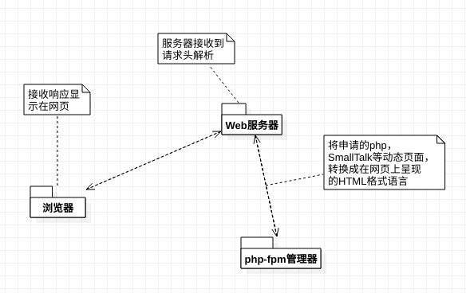

#### 8.目录说明

|目录名|解释|术语|
|:--------:| :-------------:|:--:|
|one_thread|项目的单线程模式|one thread and one reactor|
|threads_server|项目的多线程模式|one reactor per thread|
|www|资源目录|-|
|webSDS|服务器文档素材|-|
### 9.类模块设计

#### 9.1 Web服务器(以one_thread为准)

- TcpServer.h类

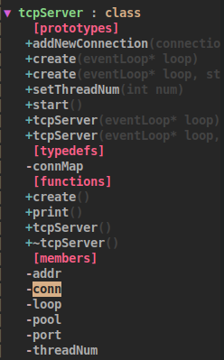

- Buffer.h类

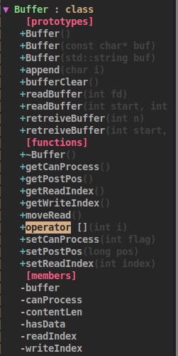

- Channel.h类

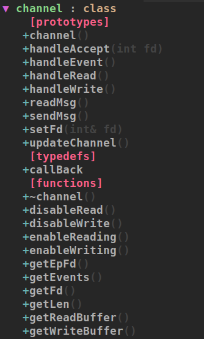

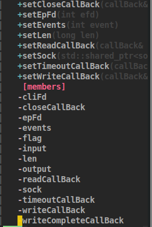
    
- EventLoop.h类

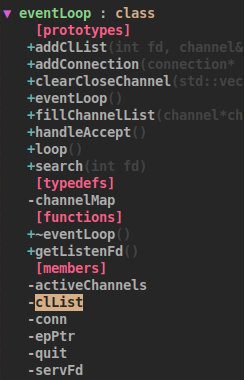

- Connection.h类

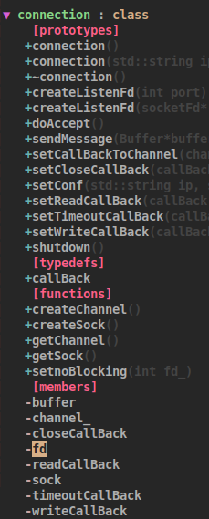

- Process.h类

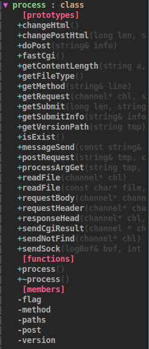

- Socket.h类

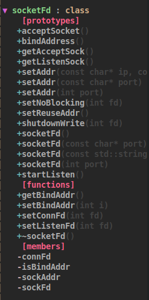

- Epoll.h类

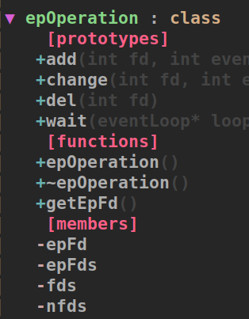

- FastCGI的使用请参考[FastCgi学习](https://blog.csdn.net/qq_41681241/article/details/98582960)

#### 10.server处理流程

- one thread + reactor

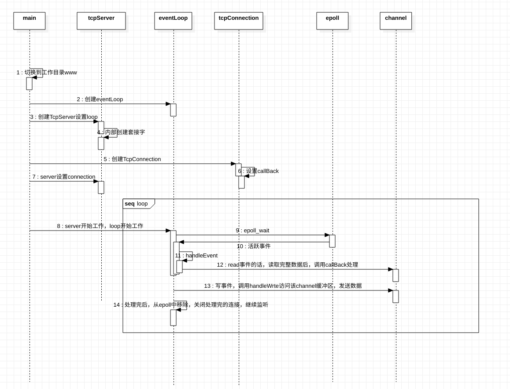

多线程的话每来一个连接，主线程不错处理，通过queueInLoop函数加入到队列中（这里用map），再通过多个匿名unix域套接字与各个子线程loop建立联系，
在主线程往unix与套接字中写，loop中的可读事件被触发，从队列中将连接信息取走，加入到子线程reactor中。该连接此后的生命周期都由子线程管理。

#### 10.功能介绍

可以处理GET请求和POST请求，支持静态网页，动态网页请求，视频在线播放，mp3在线播放等!

#### 11.压力测试(ab和webbench)

运行one_thread（单线程+reactor）中的项目，使用本地回环网卡的话直接运行./exe即可！

执行：
./exe 

ab -n 5000000 -c 1 http://127.0.0.1:8888/

结果:

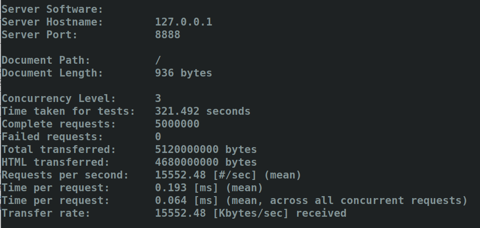

总用时：321.492s　0个失败，每秒钟处理15552.48个请求。每个请求最短时间:0.064秒

webbench测试：

webbench  -t 30 -c 1 http://127.0.0.1:8888/

结果：

30秒处理338590个请求，数据吞吐量：11557205bytes/s

以上是基于单线程+reactor测得的数据，多线程测试的数据不如人意，在效率上远不如单线程，读者可以自行测试，找问题，一起探讨，确实多线程模式还是有待优化！

